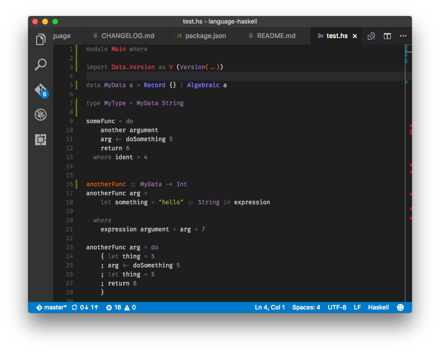

# Hawk Language support

Support for the Hawk programming language in visual studio code.

## Highlighting

Adds highlighting support for Hawk (.hk).
This is a (now heavily) modified version of the syntax file from the [Haskell TextMate bundle](https://github.com/textmate/haskell.tmbundle).

Also adds automatic indentation after `where`, `do`, `->` etc. and surrounding brackets (`[]`, `{}` etc)

## Snippets 

Includes common Haskell code snippets, such as `data` and `newtype` declarations, main module, `if` and `case`. 

## Bugs

If you happen to notice bugs or have suggestions for improvements visit the [issue section](https://github.com/andgate/language-haskell-vscode/issues) of the [repository](https://github.com/andgate/language-haskell-vscode).
